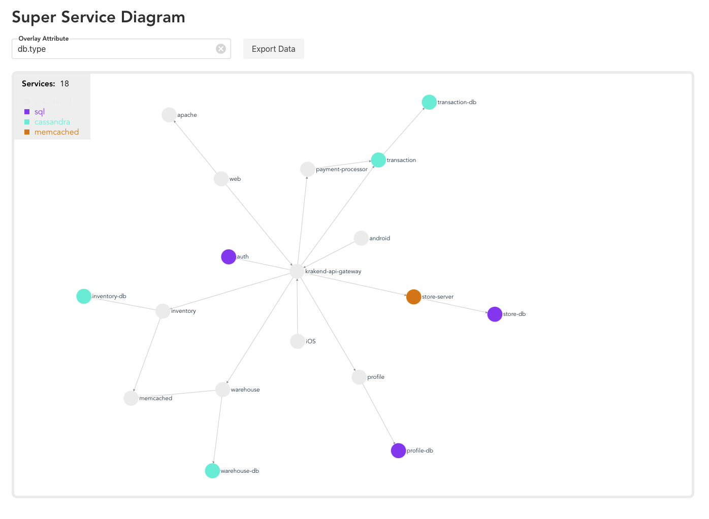

# Super Service Diagram

This example project uses Lightstep APIs to build a "static" service diagram of your system architecture and provides the additional capability to filter by attributes and their values to overlay on the service diagram.

## Running

1. Create a `.env` file in the root directory (next to `docker-compose.yml`) that contains the following values:

```shell
LIGHTSTEP_ORG=<Your org name in Lightstep>
LIGHTSTEP_PROJECT=<Your project name in Lightstep>
LIGHTSTEP_API_KEY=<Your API Key>
LIGHTSTEP_ACCESS_TOKEN=<Optional to report tracing data for this service to Lightstpe>
ENABLE_SCHEDULER=true (set to true for first run. Read more below for details)
```

2. Change an control variables as needed (see below)
3. `docker-compose build` to build the server image.
4. `docker-compose up -d` to run the databases and the server.
5. Check that the server started with `docker-logs -f super-server` . There should be streaming logs indicating scheduler is running.
6. Wait a few minutes for scheduler to complete.
7. Then either access the data via the API (see below)
8. Or, run the UI with `cd client && npm run serve`

## Architecture

The project includes the following components:

- `mongodb` - Database for local data
- `redis` - Pseudo message bus and API throttle state db
- `server` - Express Server to create an API
- `scheduler` - Job that syncs data with Lightstep
- `mixer` - Gets spans from `scheduler` and analyzes them to create local service diagram
- `client` - Vue JS application that uses D3 to visualize service diagram

While it would be nice to have each of these components split out as their own microservice in a Docker container, for now, `server`, `scheduler` and `mixer` are all part of one codebase under `server/src`

## Control Variables

Refer to `server/src/constants.js` to see how to configure some values that control the behavior of the application

## Application Flow

In general, the following describes the flow of the application.

The scheduler only runs if `ENABLE_SCHEDULER` environment variable is set to `"true"`. Otherwise, the server serves the API with whatever data exists in MongoDB.
If scheduler is enabled, it will run every 20 minutes form the top of the hour by default. This value is customizable in the control variables above.
After changing the value for `ENABLE_SCHEDULER`, you will have to stop and start the container again. Restart does not work as it preserves the environment variables.

> _NOTE_: Each run of the scheduler takes approximately 3-5 minutes. During this time, the server might be unavailable. Splitting the components into separate microservices could help ameliorate this in the future.

### Scheduled Job

**Scheduler Flow:**

1. Get all services from Lightstep API `GET /services/directory`
2. Get all streams from Lightstep API `GET /streams`
3. Get last 2 minutes of traces for stream (starting from 10 mins ago to ensure traces are assembled)
4. Send each trace to `mixer` through `redis`

**Mixer Flow:**

1. Process a service diagram per trace, timestamping edges, add to MongoDB
2. Also process attributes and their values, with timestamps

### API

The API runs on port `8080` and is available to get raw data for the service diagram and attributes

- `GET /services` - Get all services
- `GET /services?attribute=example` - Get the values of an attribute grouped by service
- `GET /services/diagram` - Get the overall service diagram
- `GET /attributes` Get all the attributes seen so far
- `GET /attributes/:name` Get all the values of an individual attribute

### UI

The experimental UI is is accessible at `localhost:8080` and is nice to visualize the data from the API. It is built in VueJS and currently allows you to view all services in a force-directed graph using D3, and let's you filter on attributes and visualize their values on a Diagram.



## TODOS

Like any good open source project, there are always items left outstanding in the first version.

**Backend**

- [ ] Better MongoDB operations (insert instead of upsert) - currently, upserting data can lock Mongo, making the API unavailable while the scheduler is running.
- [ ] Split `mixer`, `server`, and `scheduler` into their own Docker containers
- [ ] Better error handling and retry to get completeness of data
- [ ] Some outstanding `FIXME` comments

**UI**

Some nice to have items on the UI:

- [ ] Show volume of edges, an edge seen multiple times should be thicker
- [ ] Searching / Filtering diagram by service
- [ ] DAG layout so the diagram is easy to follow
- [ ] Better Coloring of services when there are too many attribute values
- [ ] Hover over an attribute value to highlight services on diagram
- [ ] Click on an attribute value to filter diagram for just those services
